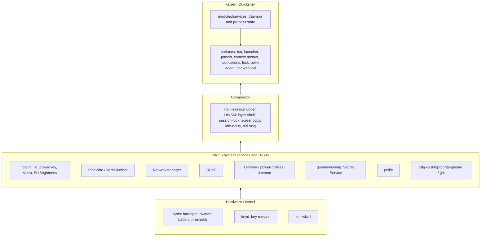

# kaizen

`kaizen` is [niri](https://niri-wm.github.io/niri/) plus a
[Quickshell](https://quickshell.org) shell: a minimal, keyboard-first desktop
that an agent can drive and verify from a terminal.

## Intent

- NixOS is the base. systemd, D-Bus, logind, PipeWire, NetworkManager, BlueZ,
  UPower, PAM, polkit and the portals do their jobs untouched; the shell reads
  and drives their state, never owns a copy of it.
- Build only what is used. A panel exists only where a subsystem has no
  keyboard-first face; infrequent tasks go to a purpose-built application
  (bluetui, nm-connection-editor).
- Keyboard-first everywhere. Pointer-only controls are bugs.
- Every action is reachable over `qs ipc`, `niri msg` or `systemctl --user`.
- Host-agnostic naming: "kaizen" in units, PAM, layer namespaces and state
  files. No hostname in the desktop's configuration.

## Layers



Each layer calls downward only.

## Where it lives

Nix holds what needs a system module, root or the store: the two lower layers,
the units and the packages, applied on rebuild. Stow holds files edited in
place, live on save: the compositor config and the shell's QML.

| Part | Path | Reaches |
| --- | --- | --- |
| Session: niri under UWSM, portals, PAM, units, the services and packages the shell and its binds use, notification rules | [`nix/shared/system/kaizen/session.nix`](nix/shared/system/kaizen/session.nix) | every kaizen host |
| Compositor config, the shell's QML | [`stow/kaizen/`](stow/kaizen/) | every kaizen host |
| Plugin more than one host imports | `nix/shared/system/kaizen/plugins/<name>/` | the hosts importing it |
| Plugin one host imports | `nix/hosts/<host>/kaizen-plugins/<name>/`, or a private submodule such as wily's `einride` | that host |
| ThinkPad hardware the shell reads (thresholds, keyd, micmute LED); not kaizen | [`nix/shared/system/thinkpad.nix`](nix/shared/system/thinkpad.nix) | ThinkPad hosts |
| Hardware, sleep policy, output layout, host-only programs | `nix/hosts/<host>/`, `stow/host/<host>/` | that host |

- Core is what kaizen needs to work as designed; every kaizen host runs it. A
  plugin is optional: the shell runs without it, however many hosts import it.
- Importing `session.nix` makes a host a kaizen host: it writes `/etc/kaizen`,
  and `dotfiles-stow` stows [`stow/kaizen/`](stow/kaizen/) only where that
  exists. So [`stow/kaizen/`](stow/kaizen/) reaches every kaizen host or none,
  and a plugin keeps its QML beside its Nix module instead. The module lists its
  directory in `host.kaizenPlugins`, read in place from the checkout.
- Nix hands the shell values only through `quickshell.service`'s environment
  (`KAIZEN_PLUGINS`, `KAIZEN_NOTIFICATION_RULES`, `KAIZEN_EMOJI_*`).
- Apps are not kaizen's: [`nix/README.md`](nix/README.md) says where they go.
- QML paths here (`modules/…`, `Ui/…`) are under
  [`stow/kaizen/.config/quickshell/`](stow/kaizen/.config/quickshell/); `niri/…`
  is under [`stow/kaizen/.config/`](stow/kaizen/.config/).

## Services to surfaces

Every service wraps one subsystem and feeds the surfaces below. IPC target is
`qs ipc call <target> ...`.

| Service | Subsystem | Bar | Panel / launcher | IPC |
| --- | --- | --- | --- | --- |
| audio (panel only) | [PipeWire] via [Quickshell] | volume button | Settings › Audio | `audio` |
| battery | [UPower], [sysfs power_supply] thresholds, [power-profiles-daemon] | battery button | Settings › Power | `battery` |
| bluetooth | [BlueZ] via [Quickshell] | button | Settings › Bluetooth | `bluetooth` |
| brightness | [sysfs backlight] via [logind] SetBrightness | – | XF86 keys | `brightness` |
| clipboard | [wl-clipboard] watcher, in memory | – | Trigger › Clipboard | `clipboard` |
| idle | [ext-idle-notify], lock service | idle indicator | Settings › Session | `idle` |
| keyboard | [niri] XKB layouts | layout indicator | Settings › Keyboard layout | `keyboard` |
| media | [MPRIS] | now-playing widget | Settings › Media | `media` |
| network | [NetworkManager], `ip -j` | button | Settings › Network | `network` |
| nightlight | [wl-gammarelay-rs] over D-Bus, the weather location for the solar position | – | Settings › Display › Nightlight | `nightlight` |
| recording | [gpu-screen-recorder], [grim], [satty], [PipeWire] | recording indicator | Trigger › Record, Pause, Stop, Screenshot (region, desktop, window) | `recording` |
| system | [hwmon], `/proc` load | alert indicator | Settings › Display | `system`, `display` |
| timezone | [timedated] via `timedatectl`, `zdump` for the DST rules | time button | Settings › Clock | `timezone` |
| weather | [met.no locationforecast] | button | Settings › Weather | `weather` |
| notifications | [Desktop Notifications] server | bell button | Settings › Notifications | `notifications` |
| lock | [ext-session-lock] + [PAM] `kaizen-lock` | – | Settings › Session | `lock` |
| curtain | [wlr-layer-shell] + [PAM] | – | Settings › Session | `curtain` |
| polkit agent | [polkit] | – | dialog on request | – |
| tray | [StatusNotifierItem] | tray | Tray | `tray` |
| background | wallpaper files, theme state | – | Settings › Display | `wallpaper`, `theme` |
| menu | launcher | menu button | `Mod+Space` | `menu` |
| plugins | `Plugin.qml` in each `host.kaizenPlugins` directory | date button, when taken over | Plugins › each plugin | `shell` (reload) |

[PipeWire]: https://pipewire.org
[Quickshell]: https://quickshell.org/docs/types/
[UPower]: https://upower.freedesktop.org
[sysfs power_supply]: https://www.kernel.org/doc/Documentation/ABI/testing/sysfs-class-power
[power-profiles-daemon]: https://gitlab.freedesktop.org/upower/power-profiles-daemon
[BlueZ]: https://github.com/bluez/bluez
[sysfs backlight]: https://www.kernel.org/doc/Documentation/ABI/stable/sysfs-class-backlight
[logind]: https://www.freedesktop.org/software/systemd/man/latest/org.freedesktop.login1.html
[dcal]: https://github.com/AvengeMedia/dankcalendar
[wl-clipboard]: https://github.com/bugaevc/wl-clipboard
[ext-idle-notify]: https://wayland.app/protocols/ext-idle-notify-v1
[niri]: https://github.com/YaLTeR/niri/wiki
[MPRIS]: https://specifications.freedesktop.org/mpris-spec/latest/
[NetworkManager]: https://networkmanager.dev
[wl-gammarelay-rs]: https://github.com/MaxVerevkin/wl-gammarelay-rs
[gpu-screen-recorder]: https://git.dec05eba.com/gpu-screen-recorder/about/
[grim]: https://sr.ht/~emersion/grim/
[satty]: https://github.com/gabm/Satty
[hwmon]: https://docs.kernel.org/hwmon/sysfs-interface.html
[met.no locationforecast]: https://api.met.no/weatherapi/locationforecast/2.0/documentation
[Desktop Notifications]: https://specifications.freedesktop.org/notification-spec/latest/
[ext-session-lock]: https://wayland.app/protocols/ext-session-lock-v1
[PAM]: https://github.com/linux-pam/linux-pam
[wlr-layer-shell]: https://wayland.app/protocols/wlr-layer-shell-unstable-v1
[polkit]: https://www.freedesktop.org/software/polkit/docs/latest/
[StatusNotifierItem]: https://www.freedesktop.org/wiki/Specifications/StatusNotifierItem/
[timedated]: https://www.freedesktop.org/software/systemd/man/latest/org.freedesktop.timedate1.html

## Time and place

- The timezone lives in [timedated] (`/etc/localtime`). The timezone service
  runs `timedatectl set-timezone` with an id from
  [`ZonesModel.js`](stow/kaizen/.config/quickshell/modules/services/timezone/ZonesModel.js)
  and reads the result back; polkit may prompt. ThinkPads leave `time.timeZone`
  unset so the choice survives rebuilds; stationary hosts pin it.
- Zones are IANA ids. tzdata evaluates DST per instant; the Clock panel shows
  offset, abbreviation, UTC and the next DST change, the last from `zdump`.
- Zone-aware formatting goes through `date(1)`. Qt's JS engine has no `Intl`
  and ignores `toLocaleString`'s `timeZone` option.
- The weather location is a coordinate picked from
  [`PlacesModel.js`](stow/kaizen/.config/quickshell/modules/services/weather/PlacesModel.js)
  and saved by the shell; the machines have no GNSS. Nightlight takes sunrise
  and sunset from the same coordinate, so one saved place moves both.
- After a zone change, restart `quickshell.service` by hand, and any other
  long-running process that shows local time, such as the calendar plugin's
  `dcal.service`: glibc caches the parsed tzfile, so a running process keeps
  the zone it started with. The restart stays manual because the shell must
  never restart while locked. Removing `/etc/localtime` is not a test; that
  falls back to UTC, which only looks like a live pickup.

## Surfaces

```
Launcher (modules/menu)            keyboard entry point; drills down levels
  ├─ Apps, Keybindings, Emoji     providers
  ├─ Trigger                      screenshots, recording, clipboard, window actions
  ├─ Settings                     per bar button: its panel, then its actions; Session
  ├─ Tray                         tray menus, cascaded per level
  └─ Plugins                      one node per plugin
Panel (Ui/Panel)                   centered card; h/l step focus
Context menu (Ui/ContextMenu)      hangs from the bar button that opened it
Bar (modules/bar)                  one PanelWindow per output
Notifications, Lock, Polkit, Background, Curtain   own layer surfaces
```

- Launcher, panel and context menu hold exclusive keyboard focus and close
  each other through `shell.claimPanel`. Pick by what opens the surface.
- A context menu opens on its button's output, sized to its rows; submenus
  cascade beside their row and `h`/`l` close and open them. Opened without a
  button (launcher, IPC), it resolves the focused output from the compositor.
  It shows a tray item's menu or a launcher level (`menu popup <id>`); a level
  marked `search` opens in the launcher instead.
- Every surface opens over IPC; niri binds are `spawn qs ipc call ...`.
- The bar mirrors the launcher; nothing is reachable only from it. Every
  panel action is a launcher row under Settings, except sliders and per-item
  detail (forgetting a network, recording options).
- Bar buttons come in four kinds, told apart by what a click does:
  - ❄ and the workspaces: left-click opens the launcher, right-click its top
    level as a context menu; a workspace takes focus.
  - Panel buttons: left-click opens the panel, right-click the button's
    Settings node as a context menu. The date is one only when a plugin takes
    it over, and opens the plugin's node; otherwise it is a plain label.
  - Indicators, shown only off the default state: left-click acts on it
    (stops the recording, re-enables idle locking, resets the layout). The
    system alert is a plain label.
  - Tray items: the app's own activation and menu.
- A plugin ([`Ui/Plugin.qml`](stow/kaizen/.config/quickshell/Ui/Plugin.qml))
  adds launcher items, its own panels and IPC targets, and may take over the
  date button (`barActions.date`): left-click calls the plugin, right-click
  opens its `plugins.<name>` node.
  [`nix/hosts/renoir/kaizen-plugins/hello/`](nix/hosts/renoir/kaizen-plugins/hello/)
  is the minimal example.
- A plugin that needs a long-running backend brings its own daemon: its module
  adds the unit, and its QML queries the daemon's IPC. The calendar
  ([`nix/shared/system/kaizen/plugins/calendar/`](nix/shared/system/kaizen/plugins/calendar/))
  does this with [dcal].
- A tray plugin is an app written for kaizen, with its own [StatusNotifierItem]
  and menu
  ([`nix/hosts/renoir/kaizen-plugins/hello-tray/`](nix/hosts/renoir/kaizen-plugins/hello-tray/)),
  so the tray and its launcher level show it without shell code. Its unit starts
  it with the session or from Apps. A third-party app with a tray icon is not a
  plugin; the tray shows it anyway.
- The curtain hides the screen, it is not a lock: an overlay layer surface
  (`kaizen-curtain`), never `WlSessionLock`, and it never touches DPMS. Both
  are deliberate. A session lock replaces output content and a disabled output
  has nothing to copy, so either one defeats wlr-screencopy; the curtain exists
  so `qs ipc call curtain close` leaves a desktop `grim` can still capture
  remotely. It dims the internal backlight to 0 while black and restores it
  before drawing the prompt, so the prompt is never painted onto a dark panel.
  Being only a layer surface, it dies with Quickshell, and anyone at the
  keyboard can close it. Use the lock whenever the machine is left alone.
- [`Ui/Compositor.qml`](stow/kaizen/.config/quickshell/Ui/Compositor.qml) is the
  only path to niri;
  [`Ui/compositors/`](stow/kaizen/.config/quickshell/Ui/compositors/) owns niri
  commands, response parsing, and the workspace source. Keep scheduling and
  shared state above it. Nightlight is not compositor-specific and lives in its
  service.

## Recording

- The camera is a circle because gpu-screen-recorder cannot mask its own
  camera overlay: the service runs mpv under the `kaizen-camera` app id and a
  niri window rule rounds and places it, so the screen capture records it as
  ordinary screen content. It must therefore sit inside a recorded region.
- Its diameter is a share of the captured frame's short side, so it covers the
  same part of the recording on a region as on an output of any resolution.
  The window rule's corner is the output's, which a region rarely reaches, so a
  region's circle is moved into the region's own bottom-right.
- The circle's scale and coordinates belong to the output it opened on, which
  is whichever one had focus, so starting a recording *with a camera* focuses
  the output being captured. Recording without one never moves focus.
- The recording service also owns the region screenshot (`grim`), because that
  reuses its region selector; `selectMode` says which of the two the selection
  feeds. Niri's own `screenshot` binds are unrelated and stay compositor-side.

## Session lifecycle

```
TTY login ─ kaizen() ─ uwsm start niri --session
  └─ wayland-session@niri.target
       ├─ quickshell.service        Restart=on-failure
       └─ kaizen-sleep-lock.service logind delay inhibitor
lid close / power key ─ logind ─ sleep-lock locks shell ─ waits for secure ─ suspend
```

Units bind to `wayland-session@niri.target`; ordering after
`graphical-session.target` is a cycle. `wayland-session-waitenv.service`
closes niri's readiness-before-`WAYLAND_DISPLAY` race.

Lid close uses logind defaults: suspend (the sleep-lock unit locks first), or
nothing when docked. Niri turns off `eDP-1` while docked with the lid closed.

## Where the shell writes

| Kind | Path | Lifetime |
| --- | --- | --- |
| Regenerable cache | `~/.cache/kaizen-shell/` | until deleted |
| State that must survive | `~/.local/state/kaizen-shell/` | across reboots |
| Lock and socket state | `$XDG_RUNTIME_DIR/kaizen-<name>` | until logout |

- These three roots only. `~/.config/quickshell/` is Stow's tree.
- Files are flat in the root, one value or small JSON document each. The
  unit's `StateDirectory=` creates the state root.
- Many or unbounded entries get a subdirectory
  (`kaizen-shell/wallpaper-thumbs/`); a single file is written directly
  (`kaizen-shell/weather-<lat>_<lon>.json`). Moving from one file to one per
  input needs a sweep first.
- Every cache producer prunes its own entries, since nothing prunes `~/.cache`
  on these hosts: touch an entry on use (a hit or a 304 counts) and delete
  entries older than 30 days in the same pass. A producer that cannot age
  entries this way says in a comment what bounds it.

## Out of scope

- Bluetooth pairing, connection editing: bluetui, nm-connection-editor.
- Output layout: hand-kept in `stow/host/<host>/.config/niri/outputs.kdl`,
  keyed by monitor, not port.
- Compositor-side XKB toggling: the shell owns layout state, and a
  compositor-side toggle would desynchronize it.
- Clipboard persistence: memory only. Offers carrying
  `x-kde-passwordManagerHint` are skipped; Proton Pass and 1Password set it, a
  password manager that does not would be recorded.
- Portal-based recording: gpu-screen-recorder talks to PipeWire directly.
- `GNOME` in `XDG_CURRENT_DESKTOP`: breaks `NotShowIn=GNOME` autostarts.
  Electron apps get `--password-store=gnome-libsecret` instead.
- Fingerprint unlock: would block typing in the single PAM stack.

## Adding something

1. Does a subsystem already do it? Read its state; do not duplicate it.
2. Does a purpose-built app do it acceptably? Launch that instead.
3. Can it be used with the keyboard only? If not, redesign.
4. Then: daemon/process state →
   [`modules/services/`](stow/kaizen/.config/quickshell/modules/services/), view
   → [`modules/panels/`](stow/kaizen/.config/quickshell/modules/panels/), both
   wired in [`shell.qml`](stow/kaizen/.config/quickshell/shell.qml); a
   protocol-driven surface with no other consumer of its state (lock,
   notifications, polkit) keeps both in `modules/<name>/`. Packages/units/PAM →
   [`session.nix`](nix/shared/system/kaizen/session.nix) (even a package another
   scope also installs), compositor →
   [`Ui/compositors/`](stow/kaizen/.config/quickshell/Ui/compositors/) and
   [`niri/config.kdl`](stow/kaizen/.config/niri/config.kdl), IPC target for
   every new action. An optional shell extension is a plugin, placed as in Where
   it lives. An app is not kaizen's to install: [`nix/README.md`](nix/README.md)
   says where it goes.
