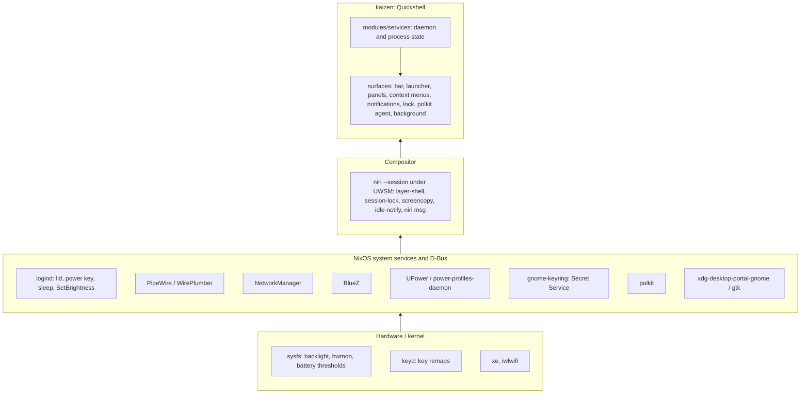

# kaizen

`kaizen` is [niri](https://niri-wm.github.io/niri/) plus a
[Quickshell](https://quickshell.org) shell: a minimal, keyboard-first desktop
that an agent can drive and verify from a terminal.

- [`features.md`](features.md): description of individual features.
- [`plugins.md`](plugins.md): optional shell extensions and how to write one.
- [`style.md`](style.md): palette, colour roles, shapes, status marks.
- [`interaction.md`](interaction.md): keys, menus, the bar, panels, tray and
  applications.
- [`development.md`](development.md): working on kaizen, validation and
  deployment.

## Intent

- NixOS is the base. systemd, D-Bus, logind, PipeWire, NetworkManager, BlueZ,
  UPower, PAM, polkit and the portals do their jobs untouched; the shell reads
  and drives their state, never owns a copy of it.
- Build only what is used. A panel exists only where a subsystem has no
  keyboard-first face; infrequent tasks go to a purpose-built application
  (bluetui, nm-connection-editor).
- Keyboard-first everywhere. Pointer-only controls are bugs.
- Every action is reachable over `qs ipc`, `niri msg` or `systemctl --user`.
- Host-agnostic naming: "kaizen" in units, PAM, layer namespaces and state
  files. No hostname in the desktop's configuration.

## Layers



Each layer calls downward only.

## Where it lives

Nix holds what needs a system module, root or the store: the two lower layers,
the units and the packages, applied on rebuild. Stow holds files edited in
place, live on save: the compositor config, the shell's and plugins' QML, which
plugins run, and the notification rules.

| Part | Path | Reaches |
| --- | --- | --- |
| Session, system half: niri under UWSM, portals, PAM, the services the shell reads | [`nix/shared/system/kaizen/session.nix`](../../nix/shared/system/kaizen/session.nix) | every kaizen host |
| Session, user half (home-manager): units, the packages the shell and its binds use | [`nix/shared/system/kaizen/home.nix`](../../nix/shared/system/kaizen/home.nix) | every home-manager user on a kaizen host |
| Compositor config, the shell's QML, the core's notification rules | [`stow/kaizen/`](../../stow/kaizen/) | every kaizen host |
| Plugin QML: generic or reusable | [`stow/kaizen/.config/quickshell/plugins/<name>/`](../../stow/kaizen/.config/quickshell/plugins/) | every kaizen host |
| Plugin QML: specific to one host | `stow/host/<host>/.config/quickshell/plugins/<name>/` | that host |
| Which plugins run, with their config | `stow/host/<host>/.config/kaizen/plugins/<name>.jsonc`, or in a private submodule's `stow/` such as wily's `einride` | that host |
| A plugin's daemon, units and packages (home-manager) | `nix/shared/system/kaizen/plugins/<name>/`, `nix/hosts/<host>/kaizen-plugins/<name>/` | the hosts importing it |
| ThinkPad hardware the shell reads (thresholds, keyd, micmute LED); not kaizen | [`nix/shared/system/thinkpad.nix`](../../nix/shared/system/thinkpad.nix) | ThinkPad hosts |
| Hardware, sleep policy, output layout, host-only programs | `nix/hosts/<host>/`, `stow/host/<host>/` | that host |

- Core is what kaizen needs to work as designed; every kaizen host runs it. A
  plugin is optional: the shell runs without it, however many hosts enable it.
- Importing `session.nix` makes a host a kaizen host: it adds `home.nix` to
  every home-manager user and writes `/etc/kaizen`, and `dotfiles-stow` stows
  [`stow/kaizen/`](../../stow/kaizen/) only where that exists. So
  [`stow/kaizen/`](../../stow/kaizen/) reaches every kaizen host or none, and a
  plugin's QML there loads only where a `~/.config/kaizen/plugins/<name>.jsonc`
  enables it.
- Nix hands the shell values only through `kaizen-shell.service`'s environment
  (`KAIZEN_EMOJI`, `KAIZEN_FIRMWARE_BACKENDS`).
- Apps are not kaizen's: [`nix/README.md`](../../nix/README.md) says where they
  go.
- QML paths here (`modules/…`, `Ui/…`) are under
  [`stow/kaizen/.config/quickshell/`](../../stow/kaizen/.config/quickshell/);
  `niri/…` is under [`stow/kaizen/.config/`](../../stow/kaizen/.config/).

## Off NixOS

The user half runs under standalone home-manager on another distro with Nix. The
`kaizen-home` check in [`flake.nix`](../../flake.nix) evaluates it that way, and
is the minimal configuration to copy: `home.nix` and each plugin's `home.nix` as
modules, `extraSpecialArgs = { inherit inputs; }` (the calendar imports
dankcalendar's module from it). Set `targets.genericLinux.enable`: it adds the
Nix profiles to the XDG paths and, through `targets.genericLinux.gpu`, the GPU
drivers Nix-built niri and Quickshell need; activation prints the one-time
`sudo` command that installs them.

The distro supplies what
[`session.nix`](../../nix/shared/system/kaizen/session.nix) does on NixOS:

- niri, UWSM, Xwayland and xwayland-satellite.
- `xdg-desktop-portal-gnome` and `-gtk`, gnome-keyring as Secret Service, and
  `xdg-terminal-exec` with ghostty as its default.
- PipeWire with its ALSA and PulseAudio layers, rtkit, UPower,
  power-profiles-daemon, BlueZ, NetworkManager, and polkit with `pkexec`.
- fwupd, when the firmware panel should read it: also set
  `kaizen.firmwareBackends = [ "fwupd" ]`.
- gpu-screen-recorder, with `cap_sys_admin+ep` on `gsr-kms-server` so monitor
  capture skips the portal dialog.
- `/etc/pam.d/kaizen-lock` holding `auth include login`, for the lock and the
  curtain.
- An empty `/etc/kaizen`: `dotfiles-stow` stows
  [`stow/kaizen/`](../../stow/kaizen/) and the shell defines `kaizen()` only
  where it exists.
- The session variables `NIXOS_OZONE_WL=1`, `QT_QPA_PLATFORMTHEME=gtk3` and
  `GTK_USE_PORTAL=1`, and the fonts in
  [`fonts.nix`](../../nix/shared/system/fonts.nix).

## Services to surfaces

Every service wraps one subsystem and feeds the surfaces below. IPC target is
`qs ipc call <target> ...`.

| Service | Subsystem | Bar | Panel / launcher | IPC |
| --- | --- | --- | --- | --- |
| audio (panel only) | [PipeWire] via [Quickshell] | volume button | Settings › Audio | `audio` |
| battery | [UPower], [sysfs power_supply] thresholds, [power-profiles-daemon] | battery button | Settings › Power | `battery` |
| bluetooth | [BlueZ] via [Quickshell] | button | Settings › Bluetooth | `bluetooth` |
| brightness | [sysfs backlight] via [logind] SetBrightness | – | XF86 keys | `brightness` |
| clipboard | [wl-clipboard] watcher, in memory | – | Trigger › Clipboard | `clipboard` |
| firmware | [fwupd] via `fwupdmgr` | firmware indicator | Settings › Firmware | `firmware` |
| idle | [ext-idle-notify], lock service | idle indicator | Settings › Session | `idle` |
| keyboard | [niri] XKB layouts | layout indicator | Settings › Keyboard layout | `keyboard` |
| log | the `kaizen-*` units' journal via `kaizen-log` | log indicator | Settings › Log | `log` |
| media | [MPRIS] | now-playing widget | Settings › Media | `media` |
| mirror | [wl-mirror] in a transient `kaizen-mirror-<target>` user unit per mirror | mirror indicator | Settings › Display › Mirror | `mirror` |
| network | [NetworkManager], `ip -j` | button | Settings › Network | `network` |
| nightlight | [wl-gammarelay-rs] over D-Bus, the weather location for the solar position | – | Settings › Display › Nightlight | `nightlight` |
| recording | [gpu-screen-recorder], [grim], [satty], [PipeWire] | recording indicator | Trigger › Record, Pause, Stop, Screenshot (region, desktop, window) | `recording` |
| system | [hwmon], `/proc` load | alert indicator | Settings › Display | `system`, `display` |
| timezone | [timedated] via `timedatectl`, `zdump` for the DST rules | time button | Settings › Clock | `timezone` |
| weather | [met.no locationforecast] | button | Settings › Weather | `weather` |
| notifications | [Desktop Notifications] server, [niri] casts for DnD | bell button | Settings › Notifications | `notifications` |
| lock | [ext-session-lock] + [PAM] `kaizen-lock` | – | Settings › Session | `lock` |
| curtain | [wlr-layer-shell] + [PAM] | – | Settings › Session | `curtain` |
| polkit agent | [polkit] | – | dialog on request | – |
| tray | [StatusNotifierItem] | tray | Tray | `tray` |
| background | wallpaper files, theme state | – | Settings › Display | `wallpaper`, `theme` |
| menu | launcher | menu button | `Mod+Space` | `menu` |
| plugins | `plugins/<name>/Plugin.qml` for each `~/.config/kaizen/plugins/<name>.jsonc` | date button, when taken over; indicators | Plugins › each plugin | `shell` (reload) |

[PipeWire]: https://pipewire.org
[Quickshell]: https://quickshell.org/docs/types/
[UPower]: https://upower.freedesktop.org
[sysfs power_supply]: https://www.kernel.org/doc/Documentation/ABI/testing/sysfs-class-power
[power-profiles-daemon]: https://gitlab.freedesktop.org/upower/power-profiles-daemon
[BlueZ]: https://github.com/bluez/bluez
[sysfs backlight]: https://www.kernel.org/doc/Documentation/ABI/stable/sysfs-class-backlight
[logind]: https://www.freedesktop.org/software/systemd/man/latest/org.freedesktop.login1.html
[wl-clipboard]: https://github.com/bugaevc/wl-clipboard
[fwupd]: https://fwupd.org
[ext-idle-notify]: https://wayland.app/protocols/ext-idle-notify-v1
[niri]: https://github.com/YaLTeR/niri/wiki
[MPRIS]: https://specifications.freedesktop.org/mpris-spec/latest/
[NetworkManager]: https://networkmanager.dev
[wl-mirror]: https://github.com/Ferdi265/wl-mirror
[wl-gammarelay-rs]: https://github.com/MaxVerevkin/wl-gammarelay-rs
[gpu-screen-recorder]: https://git.dec05eba.com/gpu-screen-recorder/about/
[grim]: https://sr.ht/~emersion/grim/
[satty]: https://github.com/gabm/Satty
[hwmon]: https://docs.kernel.org/hwmon/sysfs-interface.html
[met.no locationforecast]: https://api.met.no/weatherapi/locationforecast/2.0/documentation
[Desktop Notifications]: https://specifications.freedesktop.org/notification-spec/latest/
[ext-session-lock]: https://wayland.app/protocols/ext-session-lock-v1
[PAM]: https://github.com/linux-pam/linux-pam
[wlr-layer-shell]: https://wayland.app/protocols/wlr-layer-shell-unstable-v1
[polkit]: https://www.freedesktop.org/software/polkit/docs/latest/
[StatusNotifierItem]: https://www.freedesktop.org/wiki/Specifications/StatusNotifierItem/
[timedated]: https://www.freedesktop.org/software/systemd/man/latest/org.freedesktop.timedate1.html

## Surfaces

```text
Launcher (modules/menu)            palette; keyboard entry point, drills down levels
  ├─ Apps, Keybindings, Emoji     providers
  ├─ Trigger                      screenshots, recording, clipboard, window actions
  ├─ Settings                     per bar button: its panel, then its actions; Session
  ├─ Tray                         tray menus, cascaded per level
  └─ Plugins                      one node per plugin
Panel (Ui/Panel)                   centered card; h/l step focus
Context menu (Ui/ContextMenu)      hangs from the bar button that opened it
Bar (modules/bar)                  one PanelWindow per output
Notifications, Lock, Polkit, Background, Curtain   own layer surfaces
```

- Launcher, panel and context menu hold exclusive keyboard focus and close
  each other through `shell.claimPanel`. Pick by what opens the surface.
- A context menu opens on its button's output, sized to its rows; submenus
  cascade beside their row. Each card draws with `Ui/MenuCard`, and a query on
  one closes the cards right of it. Opened without an output (the launcher's
  Tray level), it resolves the focused output from the compositor. It shows a
  tray item's menu, or a launcher level on a bar button's right-click.
- The launcher draws the same card centred in a `Ui/Panel`, a level at a time.
  `menu popup <id>` and `menu level <id>` open it at that level.
- An application's palette draws it over the window's content
  (`Ui/MenuOverlay`), from the actions the focused item and its parents
  declare (`menuScope()`). A right-click there, or a click on a chip, hangs a
  cascading context menu from the pointer or the chip (`popup()`).
- Every surface opens over IPC; niri binds are `spawn qs ipc call ...`.
- How each surface takes input, the bar buttons' kinds included:
  [`interaction.md`](interaction.md).
- Plugins add launcher items, panels, IPC targets and bar indicators:
  [`plugins.md`](plugins.md).
- [`Ui/Compositor.qml`](../../stow/kaizen/.config/quickshell/Ui/Compositor.qml)
  is the only path to niri;
  [`Ui/compositors/`](../../stow/kaizen/.config/quickshell/Ui/compositors/) owns
  niri commands, response parsing, and the workspace source. Keep scheduling and
  shared state above it. Nightlight is not compositor-specific and lives in its
  service.

## Session

```
TTY login ─ kaizen() ─ uwsm start niri --session
  └─ wayland-session@niri.target
       ├─ kaizen-shell.service      Restart=on-failure
       └─ kaizen-sleep-lock.service logind delay inhibitor
lid close / power key ─ logind ─ sleep-lock locks shell ─ waits for secure ─ suspend
```

Units bind to `wayland-session@niri.target`; ordering after
`graphical-session.target` is a cycle. `wayland-session-waitenv.service`
closes niri's readiness-before-`WAYLAND_DISPLAY` race.

Lid close uses logind defaults: suspend (the sleep-lock unit locks first), or
nothing when docked. Niri turns off `eDP-1` while docked with the lid closed.

- XDG autostart apps start only once the shell's StatusNotifierWatcher is on
  the bus (`kaizen-tray-ready.service`), because Electron apps look for it once
  and never retry. Never gate `kaizen-shell.service` or anything before
  `graphical-session.target` on the tray: the shell registers the watcher once
  its config loads, which waits for `xdg-desktop-portal`, and the portal is
  ordered after `graphical-session.target`.
- Screen sharing from other apps goes through `xdg-desktop-portal-gnome`,
  which needs the Mutter D-Bus services that niri serves only as
  `niri --session`. Session mode also serves `org.freedesktop.ScreenSaver`
  idle inhibitors and the a11y bus, and takes the power key from logind unless
  `disable-power-key-handling` is set.
- On first use, gnome-keyring can advertise `login` without exporting the
  collection when keyring creation follows D-Bus startup. Recover by
  restarting the keyring daemon and unlocking it, then retry account setup.
  Do not delete keyring files.
- Chromium and Electron pick their secret store from `XDG_CURRENT_DESKTOP`. They
  do not recognise `niri` and fall back to `basic_text`, so logins and secrets
  do not persist or are stored under a hardcoded key. Wrap each such app with
  `pkgs.withGnomeLibsecret` (`nix/shared/overlays/`), which adds
  `--password-store=gnome-libsecret`; `chromium` passes the flag directly. Do
  not add `GNOME` to `XDG_CURRENT_DESKTOP`: autostart entries such as
  `nm-applet` and `print-applet` use `NotShowIn=GNOME`. Once an app has
  encrypted secrets with the keyring, removing the flag locks it out of them.

## Where the shell writes

| Kind | Path | Lifetime |
| --- | --- | --- |
| Regenerable cache | `~/.cache/kaizen-shell/` | until deleted |
| State that must survive | `~/.local/state/kaizen-shell/` | across reboots |
| Lock and socket state | `$XDG_RUNTIME_DIR/kaizen-<name>` | until logout |

- These three roots only. `~/.config/quickshell/` and `~/.config/kaizen/` are
  Stow's trees.
- Files are flat in the root, one value or small JSON document each. The
  unit's `StateDirectory=` creates the state root.
- Many or unbounded entries get a subdirectory
  (`kaizen-shell/wallpaper-thumbs/`); a single file is written directly
  (`kaizen-shell/weather-<lat>_<lon>.json`). Moving from one file to one per
  input needs a sweep first.
- Every cache producer prunes its own entries, since nothing prunes `~/.cache`
  on these hosts: touch an entry on use (a hit or a 304 counts) and delete
  entries older than 30 days in the same pass. A producer that cannot age
  entries this way says in a comment what bounds it.
- Plugins write under the same roots: [`plugins.md`](plugins.md) › Writing one.

## Out of scope

- Bluetooth pairing, connection editing: bluetui, nm-connection-editor.
- Output layout: hand-kept in `stow/host/<host>/.config/niri/outputs.kdl`,
  keyed by monitor, not port.
- Compositor-side XKB toggling: the shell owns layout state, and a
  compositor-side toggle would desynchronize it.
- Clipboard persistence: memory only. Offers carrying
  `x-kde-passwordManagerHint` are skipped; Proton Pass and 1Password set it, a
  password manager that does not would be recorded.
- Portal-based recording: gpu-screen-recorder talks to PipeWire directly.
- Fingerprint unlock: would block typing in the single PAM stack.

## Adding something

1. Does a subsystem already do it? Read its state; do not duplicate it.
2. Does a purpose-built app do it acceptably? Launch that instead.
3. Can it be used with the keyboard only? If not, redesign.
4. Then: daemon/process state →
   [`modules/services/`](../../stow/kaizen/.config/quickshell/modules/services/),
   view →
   [`modules/panels/`](../../stow/kaizen/.config/quickshell/modules/panels/),
   both wired in [`shell.qml`](../../stow/kaizen/.config/quickshell/shell.qml);
   a protocol-driven surface with no other consumer of its state (lock,
   notifications, polkit) keeps both in `modules/<name>/`. Packages and units →
   [`home.nix`](../../nix/shared/system/kaizen/home.nix) (even a package
   another scope also installs), system services and PAM →
   [`session.nix`](../../nix/shared/system/kaizen/session.nix), compositor →
   [`Ui/compositors/`](../../stow/kaizen/.config/quickshell/Ui/compositors/) and
   [`niri/config.kdl`](../../stow/kaizen/.config/niri/config.kdl), IPC target
   for every new action. An optional shell extension is a
   [plugin](plugins.md). An app is not kaizen's to install:
   [`nix/README.md`](../../nix/README.md) says where it goes.
