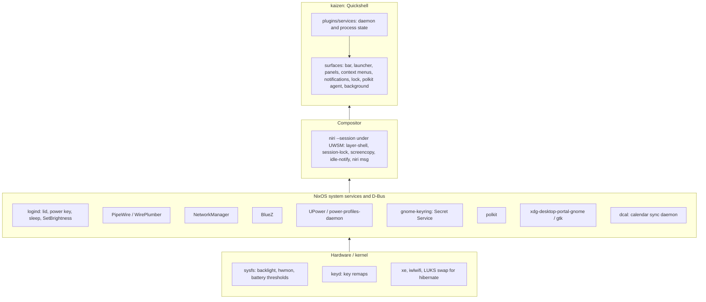

# kaizen

Design intent and current shape of the desktop on `wily`. `kaizen` is
the shell's name and the command that starts the session from the TTY. Kaizen:
the setup is polished and refined continuously, never rebuilt. Zen: minimal,
distraction-free. Read with `CLAUDE.md` (working rules, validation) and
`README.md` (hardware).

## Intent

- NixOS is the base. Proven subsystems (systemd, D-Bus, logind, PipeWire,
  NetworkManager, BlueZ, UPower, PAM, polkit, portals) do their jobs untouched.
- The GUI is bespoke and minimal: only what is used, nothing speculative,
  nothing built because it can be. A panel exists only where a subsystem has
  no keyboard-first face.
- Keyboard-first everywhere. Pointer-only controls are bugs.
- Prefer a purpose-built application over a bespoke panel for infrequent
  tasks (bluetui, nm-connection-editor, nwg-displays).
- Everything is reachable from a terminal (`qs ipc`, `niri msg`,
  `systemctl --user`) so an agent can drive and verify it.
- Host-agnostic naming: "kaizen" in units, PAM, layer namespaces, state
  files. "wily" is only a hostname.

## Foundational model



Each layer only calls downward. The shell never owns a daemon's state; it
reads and drives it. Nix (`desktop.nix`, `thinkpad.nix`) owns the two lower
layers and the systemd units; Stow (`stow/host/wily/`) owns compositor config
and QML.

## Services to surfaces

Every service wraps one subsystem and feeds the surfaces below. IPC target is
`qs ipc call <target> ...`.

| Service | Subsystem | Bar | Panel / launcher | IPC |
| --- | --- | --- | --- | --- |
| audio (panel only) | PipeWire (Quickshell.Services.Pipewire) | volume button | Setup › Audio | `audio` |
| battery | UPower, sysfs thresholds, power-profiles-daemon | battery button | Setup › Power | `battery` |
| bluetooth | BlueZ (Quickshell.Bluetooth) | button | Setup › Bluetooth | `bluetooth` |
| brightness | sysfs backlight via logind SetBrightness | – | XF86 keys | `brightness` |
| calendar | dcal JSON IPC | clock | Panels › Calendar | `calendar` |
| clipboard | wl-paste watcher, in memory | – | Trigger › Clipboard | `clipboard` |
| idle | Wayland idle-notify, lock service | – | System › Idle | `idle` |
| keyboard | niri XKB layouts | layout button | Setup › Keyboard | `keyboard` |
| media | MPRIS | now-playing widget | Panels › Media | `media` |
| network | NetworkManager, `ip -j` | button | Setup › Network | `network` |
| nightlight | wl-gammarelay-rs over D-Bus (wlr-gamma-control) | – | Setup › Nightlight | `nightlight` |
| recording | gpu-screen-recorder, grim, PipeWire | recording indicator | Trigger › Record, Screenshot (region) | `recording` |
| system | hwmon, load | monitor button | Setup › Display | `system`, `display` |
| weather | api.met.no | button | Panels › Weather, Setup › Weather location | `weather` |
| notifications | freedesktop Notifications server | – | System › Notifications | `notifications` |
| lock | WlSessionLock + PAM `kaizen-lock` | – | System › Lock | `lock` |
| screensaver | layer-shell curtain + PAM | – | System › Screensaver | `screensaver` |
| polkit agent | polkit | – | dialog on request | – |
| tray | StatusNotifierItem | tray | Tray | `tray` |
| background | wallpaper files, theme state | – | Style | `wallpaper`, `theme` |
| menu | launcher | menu button | `Mod+Space` | `menu` |

## Surfaces

```
Launcher (plugins/menu)            keyboard entry point; drills down levels
  ├─ Apps, Keybindings, Emoji     providers
  ├─ Style / Trigger / Panels     open panels or run compositor actions
  ├─ Setup / System               settings panels, session actions
  └─ Tray                         tray menus, cascaded per level
Panel (Ui/Panel)                   centered card; h/l step focus
Context menu (Ui/ContextMenu)      hangs from the bar button that opened it
Bar (plugins/bar)                  one PanelWindow per output
Notifications, Lock, Polkit, Background, Screensaver   own layer surfaces
```

- Launcher, panel and context menu hold exclusive keyboard focus and close
  each other through `shell.claimPanel`. Pick by what opens the surface.
- Every surface opens over IPC; niri binds are `spawn qs ipc call ...`.
- `Ui/Compositor.qml` is the only path to niri. Views never call `niri msg`.

## Session lifecycle

```
TTY login ─ kaizen() ─ uwsm start niri --session
  └─ wayland-session@niri.target
       ├─ quickshell.service        Restart=on-failure
       ├─ dcal.service              waits for Secret Service
       └─ kaizen-sleep-lock.service logind delay inhibitor
lid close / power key ─ logind ─ sleep-lock locks shell ─ waits for secure ─ suspend
  └─ HibernateDelaySec=2h ─ hibernate to LUKS swap
```

Units bind to `wayland-session@niri.target`, never after
`graphical-session.target` (cycle). `wayland-session-waitenv.service` closes
niri's readiness-before-`WAYLAND_DISPLAY` race.

## Deliberately not built

- Bluetooth pairing, connection editing, output layout: bluetui,
  nm-connection-editor, nwg-displays.
- Compositor-side XKB toggling: the shell owns layout state.
- Clipboard persistence: memory only, skips password-manager offers.
- Portal-based recording: gpu-screen-recorder talks to PipeWire directly.
- `GNOME` in `XDG_CURRENT_DESKTOP`: breaks `NotShowIn=GNOME` autostarts.
  Electron apps get `--password-store=gnome-libsecret` instead.
- Fingerprint unlock: would block typing in the single PAM stack.

## Adding something

1. Does a subsystem already do it? Read its state; do not duplicate it.
2. Does a purpose-built app do it acceptably? Launch that instead.
3. Can it be used with the keyboard only? If not, redesign.
4. Then: daemon/process state → `plugins/services/`, view →
   `plugins/panels/`, packages/units/PAM → `desktop.nix`, compositor →
   `Ui/compositors/` and `niri/config.kdl`, IPC target for every new action.

## Known debt

- **Shell crash while locked.** `quickshell.service` is `Restart=on-failure`
  and the lock is a Quickshell client. niri keeps the session lock after the
  client dies; whether the restarted shell re-creates the lock surface is
  unverified (auth state is in memory only). Verify, then add a lock-aware
  restart or a fallback unlocker if needed.
- **Color picker is an inline shell pipeline in `shell.qml`.** Belongs in a
  service or the compositor interface like screenshots.
- **The launcher tree lives in `shell.qml`.** Fine at this size; move it to
  `plugins/menu/` if it grows or gets host-specific entries.
- **dcal is a second Quickshell.** It launches its own UI; only the daemon
  and JSON IPC are used. Track whether the daemon can run without the
  Quickshell dependency.
