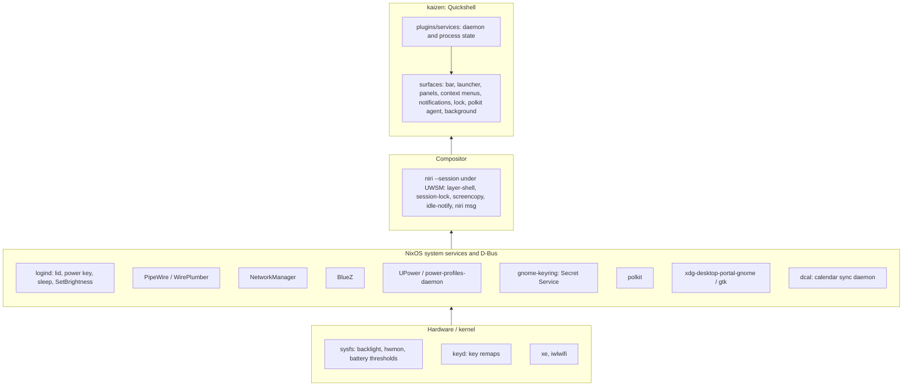

# kaizen

`kaizen` is [niri](https://niri-wm.github.io/niri/) plus a
[Quickshell](https://quickshell.org) shell: a minimal, keyboard-first desktop
that an agent can drive and verify from a terminal.

## Intent

- NixOS is the base. systemd, D-Bus, logind, PipeWire, NetworkManager, BlueZ,
  UPower, PAM, polkit and the portals do their jobs untouched; the shell reads
  and drives their state, never owns a copy of it.
- Build only what is used. A panel exists only where a subsystem has no
  keyboard-first face; infrequent tasks go to a purpose-built application
  (bluetui, nm-connection-editor).
- Keyboard-first everywhere. Pointer-only controls are bugs.
- Every action is reachable over `qs ipc`, `niri msg` or `systemctl --user`.
- Host-agnostic naming: "kaizen" in units, PAM, layer namespaces and state
  files. No hostname in the desktop's configuration.

## Layers



Each layer calls downward only. Nix (`desktop.nix`, `thinkpad.nix`) owns the
two lower layers and the systemd units; Stow (`stow/kaizen/`) owns compositor
config and QML. Both are shared by every kaizen host.

## Services to surfaces

Every service wraps one subsystem and feeds the surfaces below. IPC target is
`qs ipc call <target> ...`.

| Service | Subsystem | Bar | Panel / launcher | IPC |
| --- | --- | --- | --- | --- |
| audio (panel only) | [PipeWire] via [Quickshell] | volume button | Settings › Audio | `audio` |
| battery | [UPower], [sysfs power_supply] thresholds, [power-profiles-daemon] | battery button | Settings › Power | `battery` |
| bluetooth | [BlueZ] via [Quickshell] | button | Settings › Bluetooth | `bluetooth` |
| brightness | [sysfs backlight] via [logind] SetBrightness | – | XF86 keys | `brightness` |
| calendar | [dcal] JSON IPC | date button | Settings › Calendar | `calendar` |
| clipboard | [wl-clipboard] watcher, in memory | clipboard button | Settings › Clipboard | `clipboard` |
| idle | [ext-idle-notify], lock service | idle indicator | Settings › Session | `idle` |
| keyboard | [niri] XKB layouts | layout indicator | Settings › Keyboard layout | `keyboard` |
| media | [MPRIS] | now-playing widget | Settings › Media | `media` |
| network | [NetworkManager], `ip -j` | button | Settings › Network | `network` |
| nightlight | [wl-gammarelay-rs] over D-Bus, the weather location for the solar position | – | Settings › Display › Nightlight | `nightlight` |
| recording | [gpu-screen-recorder], [grim], [satty], [PipeWire] | recording indicator | Trigger › Record, Pause, Stop, Screenshot (region, desktop, window) | `recording` |
| system | [hwmon], `/proc` load | monitor button | Settings › Display | `system`, `display` |
| timezone | [timedated] via `timedatectl`, `zdump` for the DST rules | time button | Settings › Clock | `timezone` |
| weather | [met.no locationforecast] | button | Settings › Weather | `weather` |
| notifications | [Desktop Notifications] server | bell button | Settings › Notifications | `notifications` |
| lock | [ext-session-lock] + [PAM] `kaizen-lock` | – | Settings › Session | `lock` |
| screensaver | [wlr-layer-shell] curtain + [PAM] | – | Settings › Session | `screensaver` |
| polkit agent | [polkit] | – | dialog on request | – |
| tray | [StatusNotifierItem] | tray | Tray | `tray` |
| background | wallpaper files, theme state | – | Settings › Display | `wallpaper`, `theme` |
| menu | launcher | menu button | `Mod+Space` | `menu` |

[PipeWire]: https://pipewire.org
[Quickshell]: https://quickshell.org/docs/types/
[UPower]: https://upower.freedesktop.org
[sysfs power_supply]: https://www.kernel.org/doc/Documentation/ABI/testing/sysfs-class-power
[power-profiles-daemon]: https://gitlab.freedesktop.org/upower/power-profiles-daemon
[BlueZ]: https://github.com/bluez/bluez
[sysfs backlight]: https://www.kernel.org/doc/Documentation/ABI/stable/sysfs-class-backlight
[logind]: https://www.freedesktop.org/software/systemd/man/latest/org.freedesktop.login1.html
[dcal]: https://github.com/AvengeMedia/dankcalendar
[wl-clipboard]: https://github.com/bugaevc/wl-clipboard
[ext-idle-notify]: https://wayland.app/protocols/ext-idle-notify-v1
[niri]: https://github.com/YaLTeR/niri/wiki
[MPRIS]: https://specifications.freedesktop.org/mpris-spec/latest/
[NetworkManager]: https://networkmanager.dev
[wl-gammarelay-rs]: https://github.com/MaxVerevkin/wl-gammarelay-rs
[gpu-screen-recorder]: https://git.dec05eba.com/gpu-screen-recorder/about/
[grim]: https://sr.ht/~emersion/grim/
[satty]: https://github.com/gabm/Satty
[hwmon]: https://docs.kernel.org/hwmon/sysfs-interface.html
[met.no locationforecast]: https://api.met.no/weatherapi/locationforecast/2.0/documentation
[Desktop Notifications]: https://specifications.freedesktop.org/notification-spec/latest/
[ext-session-lock]: https://wayland.app/protocols/ext-session-lock-v1
[PAM]: https://github.com/linux-pam/linux-pam
[wlr-layer-shell]: https://wayland.app/protocols/wlr-layer-shell-unstable-v1
[polkit]: https://www.freedesktop.org/software/polkit/docs/latest/
[StatusNotifierItem]: https://www.freedesktop.org/wiki/Specifications/StatusNotifierItem/
[timedated]: https://www.freedesktop.org/software/systemd/man/latest/org.freedesktop.timedate1.html

## Time and place

- The timezone lives in [timedated] (`/etc/localtime`). The timezone service
  runs `timedatectl set-timezone` with an id from `ZonesModel.js` and reads the
  result back; polkit may prompt. ThinkPads leave `time.timeZone` unset so the
  choice survives rebuilds; stationary hosts pin it.
- Zones are IANA ids. tzdata evaluates DST per instant; the Clock panel shows
  offset, abbreviation, UTC and the next DST change, the last from `zdump`.
- Zone-aware formatting goes through `date(1)`. Qt's JS engine has no `Intl`
  and ignores `toLocaleString`'s `timeZone` option.
- The weather location is a coordinate picked from `PlacesModel.js` and saved
  by the shell; the machines have no GNSS. Nightlight takes sunrise and sunset
  from the same coordinate, so one saved place moves both.
- After a zone change, restart `quickshell.service` and `dcal.service` by
  hand: glibc caches the parsed tzfile, so a running process keeps the zone it
  started with. The restart stays manual because the shell must never restart
  while locked. Removing `/etc/localtime` is not a test; that falls back to
  UTC, which only looks like a live pickup.

## Surfaces

```
Launcher (plugins/menu)            keyboard entry point; drills down levels
  ├─ Apps, Keybindings, Emoji     providers
  ├─ Trigger                      screenshots, recording, window actions
  ├─ Settings                     per bar button: its panel, then its actions; Session
  └─ Tray                         tray menus, cascaded per level
Panel (Ui/Panel)                   centered card; h/l step focus
Context menu (Ui/ContextMenu)      hangs from the bar button that opened it
Bar (plugins/bar)                  one PanelWindow per output
Notifications, Lock, Polkit, Background, Screensaver   own layer surfaces
```

- Launcher, panel and context menu hold exclusive keyboard focus and close
  each other through `shell.claimPanel`. Pick by what opens the surface.
- Every surface opens over IPC; niri binds are `spawn qs ipc call ...`.
- The bar mirrors the launcher; nothing is reachable only from it. Every
  panel action is a launcher row under Settings, except sliders and per-item
  detail (forgetting a network, recording options).
- `Ui/Compositor.qml` is the only path to niri.

## Session lifecycle

```
TTY login ─ kaizen() ─ uwsm start niri --session
  └─ wayland-session@niri.target
       ├─ quickshell.service        Restart=on-failure
       ├─ dcal.service              waits for Secret Service
       └─ kaizen-sleep-lock.service logind delay inhibitor
lid close / power key ─ logind ─ sleep-lock locks shell ─ waits for secure ─ suspend
```

Units bind to `wayland-session@niri.target`; ordering after
`graphical-session.target` is a cycle. `wayland-session-waitenv.service`
closes niri's readiness-before-`WAYLAND_DISPLAY` race.

## Where the shell writes

| Kind | Path | Lifetime |
| --- | --- | --- |
| Regenerable cache | `~/.cache/kaizen-shell/` | until deleted |
| State that must survive | `~/.local/state/kaizen-shell/` | across reboots |
| Lock and socket state | `$XDG_RUNTIME_DIR/kaizen-<name>` | until logout |

- These three roots only. `~/.config/quickshell/` is Stow's tree.
- Files are flat in the root, one value or small JSON document each. The
  unit's `StateDirectory=` creates the state root.
- Many or unbounded entries get a subdirectory
  (`kaizen-shell/wallpaper-thumbs/`); a single file is written directly
  (`kaizen-shell/weather-<lat>_<lon>.json`). Moving from one file to one per
  input needs a sweep first.
- Every cache producer prunes its own entries, since nothing prunes `~/.cache`
  on these hosts: touch an entry on use (a hit or a 304 counts) and delete
  entries older than 30 days in the same pass. A producer that cannot age
  entries this way says in a comment what bounds it.

## Out of scope

- Bluetooth pairing, connection editing: bluetui, nm-connection-editor.
- Output layout: hand-kept in `niri/outputs.kdl`, keyed by monitor, not port.
- Compositor-side XKB toggling: the shell owns layout state.
- Clipboard persistence: memory only, skips password-manager offers.
- Portal-based recording: gpu-screen-recorder talks to PipeWire directly.
- `GNOME` in `XDG_CURRENT_DESKTOP`: breaks `NotShowIn=GNOME` autostarts.
  Electron apps get `--password-store=gnome-libsecret` instead.
- Fingerprint unlock: would block typing in the single PAM stack.

## Adding something

1. Does a subsystem already do it? Read its state; do not duplicate it.
2. Does a purpose-built app do it acceptably? Launch that instead.
3. Can it be used with the keyboard only? If not, redesign.
4. Then: daemon/process state → `plugins/services/`, view →
   `plugins/panels/`; a protocol-driven surface with no other consumer of its
   state (lock, notifications, polkit) keeps both in `plugins/<name>/`.
   Packages/units/PAM → `desktop.nix`, compositor → `Ui/compositors/` and
   `niri/config.kdl`, IPC target for every new action.
