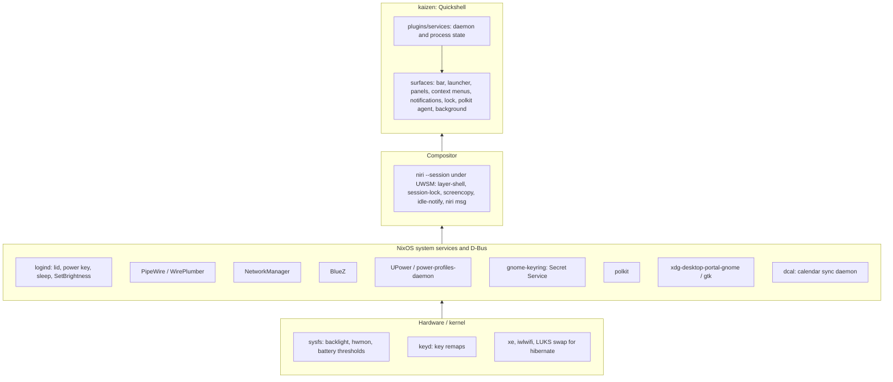

# kaizen

This document outlines `kaizen`; a combination of the Wayland compositor
[niri](https://niri-wm.github.io/niri/) and
[Quickshell](https://quickshell.org) - to form a tailor-made (for me),
minimalistic and productive desktop environment which can be agent-testable.

## Intent

- NixOS is the base. Proven subsystems (systemd, D-Bus, logind, PipeWire,
  NetworkManager, BlueZ, UPower, PAM, polkit, portals) do their jobs untouched.
- The GUI is bespoke and minimal: only what is used, nothing speculative,
  nothing built because it can be. A panel exists only where a subsystem has
  no keyboard-first face.
- Keyboard-first everywhere. Pointer-only controls are considered when no other
  reasonable option exists.
- Prefer a purpose-built application over a bespoke panel for infrequent
  tasks (bluetui, nm-connection-editor, nwg-displays).
- Everything is reachable from a terminal (`qs ipc`, `niri msg`,
  `systemctl --user`) so an agent can drive and verify it.
- Host-agnostic naming: "kaizen" in units, PAM, layer namespaces, state
  files. A hostname never appears in the desktop's configuration.

## Foundational model



Each layer only calls downward. The shell never owns a daemon's state; it
reads and drives it. Nix (`desktop.nix`, `thinkpad.nix`) owns the two lower
layers and the systemd units; Stow (`stow/kaizen/`) owns compositor config
and QML. Both are shared by every host running kaizen.

## Services to surfaces

Every service wraps one subsystem and feeds the surfaces below. IPC target is
`qs ipc call <target> ...`.

| Service | Subsystem | Bar | Panel / launcher | IPC |
| --- | --- | --- | --- | --- |
| audio (panel only) | [PipeWire] via [Quickshell] | volume button | Setup › Audio | `audio` |
| battery | [UPower], [sysfs power_supply] thresholds, [power-profiles-daemon] | battery button | Setup › Power | `battery` |
| bluetooth | [BlueZ] via [Quickshell] | button | Setup › Bluetooth | `bluetooth` |
| brightness | [sysfs backlight] via [logind] SetBrightness | – | XF86 keys | `brightness` |
| calendar | [dcal] JSON IPC | date button | Panels › Calendar | `calendar` |
| clipboard | [wl-clipboard] watcher, in memory | – | Trigger › Clipboard | `clipboard` |
| idle | [ext-idle-notify], lock service | – | System › Idle | `idle` |
| keyboard | [niri] XKB layouts | layout button | Setup › Keyboard | `keyboard` |
| media | [MPRIS] | now-playing widget | Panels › Media | `media` |
| network | [NetworkManager], `ip -j` | button | Setup › Network | `network` |
| nightlight | [wl-gammarelay-rs] over D-Bus, the weather location for the solar position | – | Setup › Nightlight | `nightlight` |
| recording | [gpu-screen-recorder], [grim], [PipeWire] | recording indicator | Trigger › Record, Screenshot (region) | `recording` |
| system | [hwmon], `/proc` load | monitor button | Setup › Display | `system`, `display` |
| timezone | [timedated] via `timedatectl`, `zdump` for the DST rules | time button | Panels › Clock, Setup › Timezone | `timezone` |
| weather | [met.no locationforecast] | button | Panels › Weather, Setup › Weather location | `weather` |
| notifications | [Desktop Notifications] server | – | System › Notifications | `notifications` |
| lock | [ext-session-lock] + [PAM] `kaizen-lock` | – | System › Lock | `lock` |
| screensaver | [wlr-layer-shell] curtain + [PAM] | – | System › Screensaver | `screensaver` |
| polkit agent | [polkit] | – | dialog on request | – |
| tray | [StatusNotifierItem] | tray | Tray | `tray` |
| background | wallpaper files, theme state | – | Style | `wallpaper`, `theme` |
| menu | launcher | menu button | `Mod+Space` | `menu` |

[PipeWire]: https://pipewire.org
[Quickshell]: https://quickshell.org/docs/types/
[UPower]: https://upower.freedesktop.org
[sysfs power_supply]: https://www.kernel.org/doc/Documentation/ABI/testing/sysfs-class-power
[power-profiles-daemon]: https://gitlab.freedesktop.org/upower/power-profiles-daemon
[BlueZ]: https://github.com/bluez/bluez
[sysfs backlight]: https://www.kernel.org/doc/Documentation/ABI/stable/sysfs-class-backlight
[logind]: https://www.freedesktop.org/software/systemd/man/latest/org.freedesktop.login1.html
[dcal]: https://github.com/AvengeMedia/dankcalendar
[wl-clipboard]: https://github.com/bugaevc/wl-clipboard
[ext-idle-notify]: https://wayland.app/protocols/ext-idle-notify-v1
[niri]: https://github.com/YaLTeR/niri/wiki
[MPRIS]: https://specifications.freedesktop.org/mpris-spec/latest/
[NetworkManager]: https://networkmanager.dev
[wl-gammarelay-rs]: https://github.com/MaxVerevkin/wl-gammarelay-rs
[gpu-screen-recorder]: https://git.dec05eba.com/gpu-screen-recorder/about/
[grim]: https://sr.ht/~emersion/grim/
[hwmon]: https://docs.kernel.org/hwmon/sysfs-interface.html
[met.no locationforecast]: https://api.met.no/weatherapi/locationforecast/2.0/documentation
[Desktop Notifications]: https://specifications.freedesktop.org/notification-spec/latest/
[ext-session-lock]: https://wayland.app/protocols/ext-session-lock-v1
[PAM]: https://github.com/linux-pam/linux-pam
[wlr-layer-shell]: https://wayland.app/protocols/wlr-layer-shell-unstable-v1
[polkit]: https://www.freedesktop.org/software/polkit/docs/latest/
[StatusNotifierItem]: https://www.freedesktop.org/wiki/Specifications/StatusNotifierItem/
[timedated]: https://www.freedesktop.org/software/systemd/man/latest/org.freedesktop.timedate1.html

## Time and place

Two separate inputs. The zone belongs to the system; the location is the one
value the shell saves itself.

The timezone is whatever [timedated] holds in `/etc/localtime`. The clock, the
calendar panel and dcal read local time from it. The ThinkPads leave
`time.timeZone` unset so `timedatectl set-timezone` persists across rebuilds;
the stationary hosts pin it. The timezone service drives that
command from `ZonesModel.js` and reads the result back — timedated already
persists the zone, and a second copy in the shell's own state could disagree
with the system every other process reads. Setting it goes through polkit, so
the agent may ask before the change lands.

DST is handled nowhere in this repository: a zone name is a rule set and
tzdata evaluates it per instant, so the list holds IANA ids and never offsets.
Storing an offset is what would break twice a year. The Clock panel exists to
show that this is actually so — offset, abbreviation, UTC, whether DST is in
effect and when it next changes, the last two read from `zdump`.

Zone-aware formatting has to come from `date(1)`. Qt's JS engine has no `Intl`
and silently ignores `toLocaleString`'s `timeZone` option rather than failing,
so every zone renders as the local one.

The weather location is a coordinate and cannot be derived from a zone —
`Europe/Stockholm` resolves to Stockholm, 400 km from home. It is picked from
`PlacesModel.js` and saved, because these machines cannot sense where they
are: a ThinkPad only has GNSS when a WWAN card carrying it is fitted, and none
is. Nightlight takes sunrise and sunset from that same coordinate, so there is
one saved place and a change of it moves both.

After changing the zone, restart `quickshell.service` and `dcal.service`.
glibc caches the parsed tzfile, and replacing `/etc/localtime` — which is what
setting a zone does — does not invalidate it, so a running process keeps the
zone it started with. The calendar panel is affected too: dcal hands over
absolute UTC instants and `CalendarModel.js` converts them in the shell.

Do not conclude from a test that removes `/etc/localtime` that the change is
picked up live. That case fails the read and falls back to UTC, which looks
like it followed; replacing the file is not noticed at all. The Clock panel
compares `date(1)`'s offset against Qt's own `"tt"` and says which is which,
so the difference is visible rather than inferred.

Never automate that restart on `/etc/localtime` changing: the shell must not
be restarted while locked.

## Surfaces

```
Launcher (plugins/menu)            keyboard entry point; drills down levels
  ├─ Apps, Keybindings, Emoji     providers
  ├─ Style / Trigger / Panels     open panels or run compositor actions
  ├─ Setup / System               settings panels, session actions
  └─ Tray                         tray menus, cascaded per level
Panel (Ui/Panel)                   centered card; h/l step focus
Context menu (Ui/ContextMenu)      hangs from the bar button that opened it
Bar (plugins/bar)                  one PanelWindow per output
Notifications, Lock, Polkit, Background, Screensaver   own layer surfaces
```

- Launcher, panel and context menu hold exclusive keyboard focus and close
  each other through `shell.claimPanel`. Pick by what opens the surface.
- Every surface opens over IPC; niri binds are `spawn qs ipc call ...`.
- `Ui/Compositor.qml` is the only path to niri. Views never call `niri msg`.

## Session lifecycle

```
TTY login ─ kaizen() ─ uwsm start niri --session
  └─ wayland-session@niri.target
       ├─ quickshell.service        Restart=on-failure
       ├─ dcal.service              waits for Secret Service
       └─ kaizen-sleep-lock.service logind delay inhibitor
lid close / power key ─ logind ─ sleep-lock locks shell ─ waits for secure ─ suspend
  └─ HibernateDelaySec=2h ─ hibernate to LUKS swap
```

Units bind to `wayland-session@niri.target`, never after
`graphical-session.target` (cycle). `wayland-session-waitenv.service` closes
niri's readiness-before-`WAYLAND_DISPLAY` race.

## Where the shell writes

| Kind | Path | Lifetime |
| --- | --- | --- |
| Regenerable cache | `~/.cache/kaizen-shell/` | until deleted |
| State that must survive | `~/.local/state/kaizen-shell/` | across reboots |
| Lock and socket state | `$XDG_RUNTIME_DIR/kaizen-<name>` | until logout |

One cache root, so clearing everything the shell caches is one directory.
State files stay flat inside that directory: each holds one value or a small
JSON document. The unit's `StateDirectory=` creates it before the shell
starts, which is why no producer has to.

Locks and sockets go in the runtime directory: it is user-owned, mode 0700
and cleared at logout, which is a lock's lifetime. Nothing that must survive
a reboot goes there.

Within a root, cardinality picks the shape: many or unbounded entries get a
subdirectory (`kaizen-shell/wallpaper-thumbs/`), one file is written directly
(`kaizen-shell/weather-<lat>_<lon>.json`). A producer that moves from one file
to one per input needs a sweep first.

Nothing prunes `~/.cache` on these hosts, so every cache producer prunes its
own entries, however small they look today.

The sweep: touch an entry whenever it is used (a cache hit or a 304 counts),
and delete entries older than 30 days in the same pass. No index needed. A
producer that cannot age entries this way says in a comment what bounds it.

Write nowhere else. `~/.config/quickshell/` is Stow's tree, not a writable
location, and a fourth root only creates somewhere to forget.

## Deliberately not built

- Bluetooth pairing, connection editing, output layout: bluetui,
  nm-connection-editor, nwg-displays.
- Compositor-side XKB toggling: the shell owns layout state.
- Clipboard persistence: memory only, skips password-manager offers.
- Portal-based recording: gpu-screen-recorder talks to PipeWire directly.
- `GNOME` in `XDG_CURRENT_DESKTOP`: breaks `NotShowIn=GNOME` autostarts.
  Electron apps get `--password-store=gnome-libsecret` instead.
- Fingerprint unlock: would block typing in the single PAM stack.

## Adding something

1. Does a subsystem already do it? Read its state; do not duplicate it.
2. Does a purpose-built app do it acceptably? Launch that instead.
3. Can it be used with the keyboard only? If not, redesign.
4. Then: daemon/process state → `plugins/services/`, view →
   `plugins/panels/`, packages/units/PAM → `desktop.nix`, compositor →
   `Ui/compositors/` and `niri/config.kdl`, IPC target for every new action.
