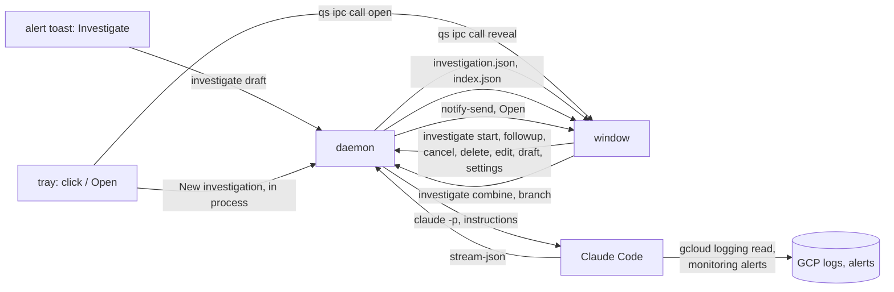

# Incident investigator

An alert toast gets an **Investigate** button. It drafts an investigation, and a
read-only Claude Code run searches GCP logs for the alert's trace id, or from
the notes (an alert or Logs Explorer URL, a time), and reports the likely root
cause.

## Configuration

Importing `default.nix` enables the plugin. Its options live under
`host.incidentInvestigator`:

```nix
host.incidentInvestigator = {
  # Required. The Claude Code profile (account and sessions) every run uses.
  claudeConfigDir = "/home/me/.claude-oncall";

  # Directories holding clones of the services' repositories. Lets a run read
  # the code at the commit that is deployed. Empty: runs read logs and alerts
  # only.
  sourceDirs = [ "/home/me/code/github.com/my-org" ];

  # Appended to Claude's system prompt on every turn, in order, read in place.
  # The default is the plugin's instructions.md. Adding a file appends to it,
  # and lib.mkForce replaces it.
  instructionFiles = [ ./my-org.md ];

  # Labels an investigation can carry, for the window's filters and badges.
  tags = [
    { name = "prod"; color = "rose"; }
    { name = "dev"; color = "water"; }
  ];

  # Notifications that get the Investigate button, and the tag of their drafts.
  alerts = [
    { match = { app = "^Slack$"; summary = " in #alerts$"; }; tag = "prod"; }
    { match = { app = "^Slack$"; summary = " in #alerts-dev$"; }; tag = "dev"; }
  ];

  # Ids in tool output listed as users and organizations, besides the
  # `users/ID` and `organizations/ID` resource names.
  entityPatterns = [
    { kind = "user"; regex = "(?i)my[_-]?user[_-]?id\\W{1,8}([A-Za-z0-9_.-]+)"; }
  ];
};
```

| Option | Default | |
| --- | --- | --- |
| `claudeConfigDir` | required | `CLAUDE_CONFIG_DIR` of the daemon and its runs |
| `sourceDirs` | `[]` | directories of repositories a run may read; see Read-only runs |
| `instructionFiles` | `[ ./instructions.md ]` | system prompt additions; list merging appends |
| `tags` | `[]` | `name`, and `color`, a palette role |
| `alerts` | `[]` | `match` as in `host.notificationRules`, and an optional `tag` |
| `entityPatterns` | `[]` | `kind` (`user`, `organization`) and a regex whose first group is the id |

An alert adds only the button. Style its toast with a `host.notificationRules`
entry with the same `match`: toasts take each setting from the first matching
rule that has one.



## Components

- `investigate` is one Go binary with two roles: `investigate serve` is the
  daemon, and the other verbs (`draft`, `edit`, `start`, `followup`, `cancel`,
  `delete`, `tag`) are short-lived clients that send one request and exit.
- The daemon is a systemd user service listening on
  `$XDG_RUNTIME_DIR/kaizen-incident-investigator.sock`. It owns the
  investigations, their state files and the `claude` processes, so reloading the
  shell does not stop a run.
- The tray icon runs inside the daemon process. It has no Quit item, as quitting
  would stop the daemon and its runs. New investigation creates the draft
  directly, with no client in between. An amber dot on the icon marks a running
  turn.
- The window is a Quickshell `FloatingWindow`. It watches the state files
  (`FileView`) and runs the client verbs when you click.
- Claude Code runs as a `claude -p` subprocess of the daemon, one per turn.
- The two dropdowns in the window's header pick the model and effort that the
  next run starts with (`settings`, kept in `settings.json`). **Run**,
  **Re-run** and the other starts store them on the investigation, which shows
  them in its header; its follow-ups and branches keep using them.
- The filters list investigations by tag, from the `tags` the daemon writes to
  `settings.json`. **New** under a tag's filter drafts an
  investigation with that tag, so the filter lists it. The tag buttons under an
  investigation's header set or clear its tag (`tag`) in any status.
- `Ctrl+K` or `?` opens the palette over the window on what has focus, nearest
  first: a row's investigation, or the picked set when there is one; the
  draft's form, the conversation (with Copy selection while text is selected)
  or the picked set's view; the list (Search list, Filter ›, Pick all listed,
  Go to ›); then the window (New, Clear, Model ›, Effort ›). A key shows where
  it runs the row. `Actions.js` lists the rows per scope. `Ctrl+Enter` in a
  draft's trace id or notes runs it; Enter in the trace id does not.
- A right-click on a row opens its context menu at the pointer, with the
  palette's rows for that row, or for the picked set when the row is picked;
  the shown investigation and the picks stay. Submenus cascade beside their
  row.
- The list is one Tab stop, its selected row. On a focused row, `j`/`k` (or
  `↑`/`↓`) move, and with Shift pick the range from the selected row. Enter
  opens it and moves focus to its draft's notes or its follow-up field. Space
  toggles it in the picked set (`j`/`k` then move only the focus), Backspace
  asks to delete the picked rows, or else the focused one, and Esc unpicks. Esc
  in a text field unpicks, then leaves the field for the selected row. Delete
  and Clear ask inline, from a button, a key or the palette alike: `y` or Enter
  confirms, and `n`, Esc or Backspace cancels.
- Shift-click (a range) or ctrl-click (a toggle) picks investigations in the
  list, and **Combine** drafts a new one from their alerts and reports
  (`combine`), with the union of their entities, or **Delete** removes them
  (running ones stay). The pencil beside one of your messages edits it and
  **Branch** (`branch`) replays the conversation from there as a new
  investigation, keeping the original. The new session gets the earlier messages
  as text, not their tool calls. Each Claude message has a copy button. A
  right-click in the conversation copies the text that a drag selected, which is
  kept within one paragraph or code block.
- The **entities** row lists the user and organization ids that the tool output
  named (`users/ID`, `organizations/ID`, and `entityPatterns`). The daemon scans
  the output itself, so the ids never pass through the model and can be resolved
  to names outside it.

## Alert flow

1. Each `alerts` entry becomes a `host.notificationRules` entry whose
   **Investigate** button runs `investigate draft` with `NOTIFICATION_APP`,
   `NOTIFICATION_SUMMARY`, `NOTIFICATION_BODY` and `INVESTIGATE_TAG`.
2. The client sends `draft` over the socket. The daemon creates the draft,
   writes it to the state files and answers with its id. A GCP alert or
   incident URL in the body becomes the notes, and its `project` parameter the
   project.
3. The client runs `qs ipc call incident-investigator reveal <id>`. The window
   opens with the draft selected.
4. You fill in the projects, trace id, notes and tag (`investigate edit`) and
   press Start (`investigate start`).
5. The daemon spawns `claude -p` with the instructions as an appended system
   prompt.
6. The daemon parses Claude's stream-json output into
   `<id>/investigation.json` and `index.json`. The window follows along. The
   report's `#` heading names the investigation.
7. When a turn finishes, the daemon sends a `notify-send` toast whose **Open**
   button runs `reveal`. Follow-ups go through `investigate followup`.

To try the flow without a real alert, fake a toast that an `alerts` entry
matches:

```sh
notify-send -a Slack "[workspace] in #alerts-dev" \
  "<https://console.cloud.google.com/monitoring/alerting/alerts/ID?project=my-project-dev|View alert>"
```

## Read-only runs

- `claude -p --restricted --tools "Bash,Read,Grep"`, plus `LSP` with
  `sourceDirs`. `--restricted` ignores settings files and confines Read and Grep
  to the run's directory and its own saved tool output.
- Allowed: `gcloud logging read`, `gcloud logging buckets list`,
  `gcloud alpha monitoring alerts describe` and `list`,
  `gcloud monitoring policies describe`, `gcloud run services describe`,
  `gcloud run revisions list` and `describe`, `gcloud run jobs describe`, Read, Grep; everything else is
  denied (`--permission-mode dontAsk`).
- `--max-budget-usd 5` per turn.
- Every run uses the `claudeConfigDir` profile. Each investigation records it,
  the window shows it, and Terminal resumes the session there. Pair
  `sourceDirs` with a profile allowed to read that code.
- With `sourceDirs`, a run also reads those directories and may run read-only
  `git -C` (`log`, `show`, `diff`, `merge-base`, `rev-parse`, `cat-file`) there,
  to compare the deployed commit (the Cloud Run image tag) with the clone. Each
  turn allows `git -C` per repository by its exact path: a wildcard before the
  subcommand would also approve options such as `-c core.fsmonitor=CMD`, which
  run commands.
- With `sourceDirs`, a run may also run `investigate checkout DIR/REPO COMMIT`,
  for a clone directly under one of them, which unpacks its commit with
  `git archive` into `<id>/src/REPO@SHA`, deleted with the investigation. Only
  stored objects are read, so a clone's branch, working tree and index stay as
  you left them. `GIT_OPTIONAL_LOCKS=0` keeps the other git commands from taking
  `.git/index.lock` too.
- The LSP tool runs the plugin's `gopls`, with `go` and `gopls` first on the
  run's PATH, and `GOPROXY=off` and `GOTOOLCHAIN=local` keep them offline.
  Definitions in other modules open in `~/go/pkg/mod`, which the run may read,
  at the version the checkout's `go.mod` pins. A module missing from the cache
  is not downloaded, and only its definitions fail.

## Where things live

State is in `~/.local/state/kaizen-shell/plugins/incident-investigator/`, the
unit's `StateDirectory` (`$STATE_DIRECTORY`), which the window reads through
`Ui.Paths.state`: `projects.json`, `settings.json`, `index.json`,
`<id>/investigation.json`, `<id>/transcript.jsonl` and the checkouts in
`<id>/src/`. Transcripts hold the log entries and code a run read, so keep the
directory as private as `sourceDirs`.

| Path                 | Holds                                    |
| -------------------- | ---------------------------------------- |
| `Plugin.qml`         | window, IPC handler, launcher item       |
| `Investigations.qml` | window content                           |
| `Format.js`          | formatting helpers for the window        |
| `Actions.js`         | the palette's rows                       |
| `tst_*.qml`          | `qmltestrunner -input .`, offscreen      |
| `investigate/`       | daemon, CLI and tray                     |
| `instructions.md`    | the base instructions for every run      |
| `claude-plugin/`     | the Claude plugin serving gopls          |
| `default.nix`        | options, package, user unit, alert rules |
